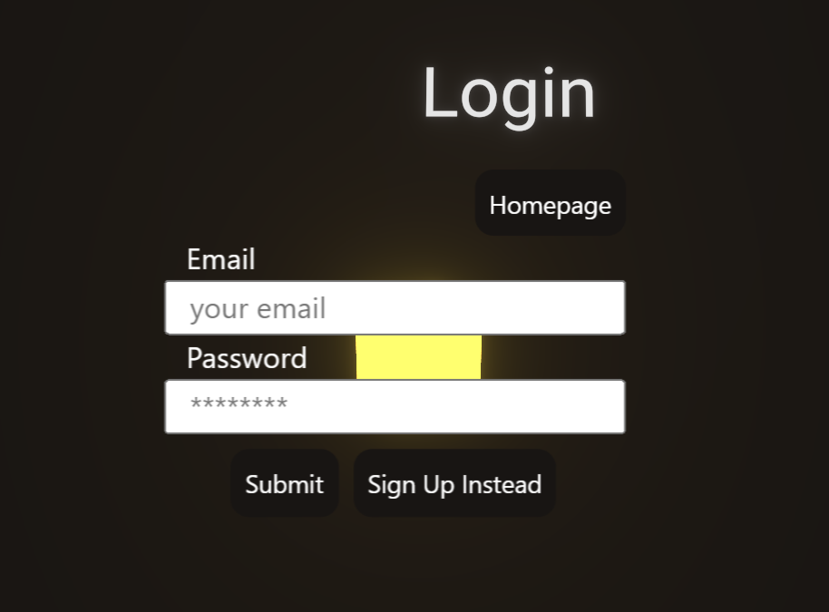
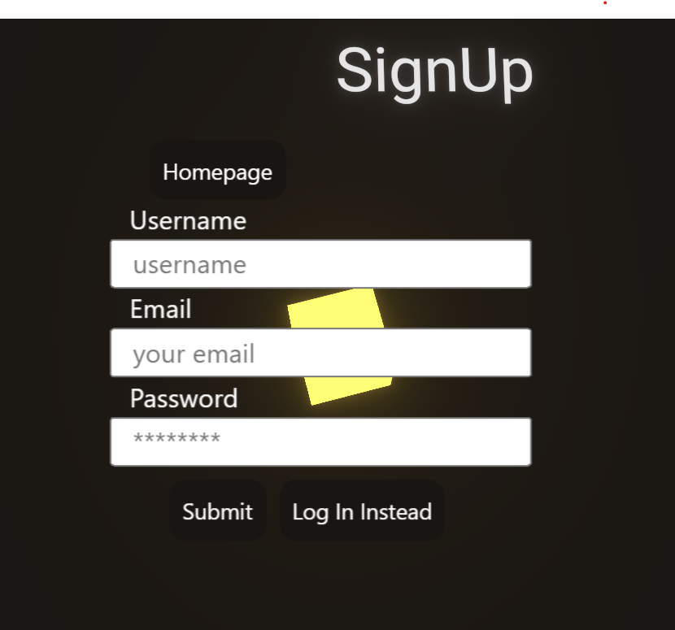
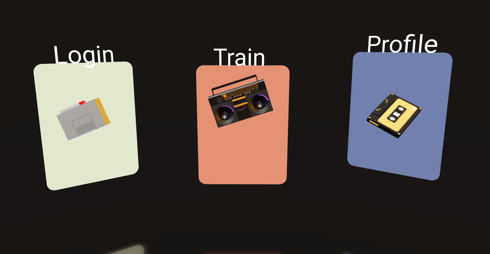
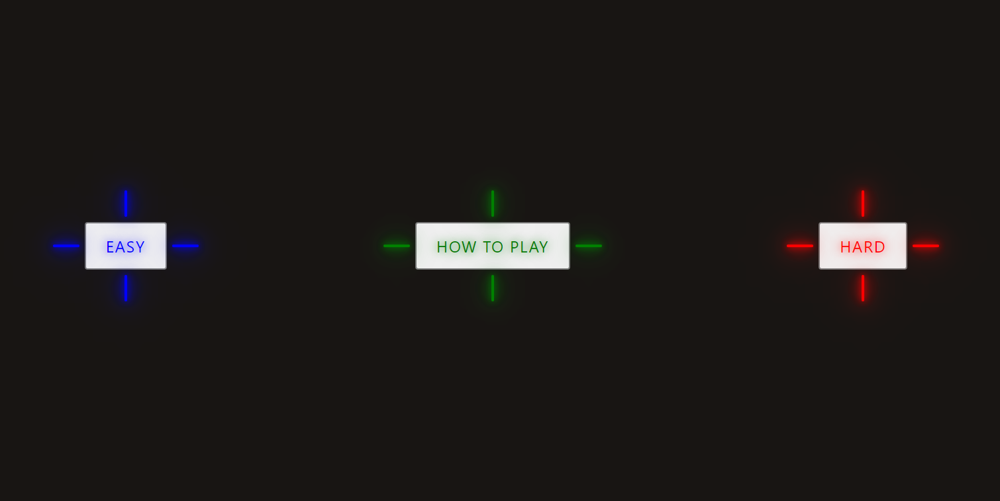
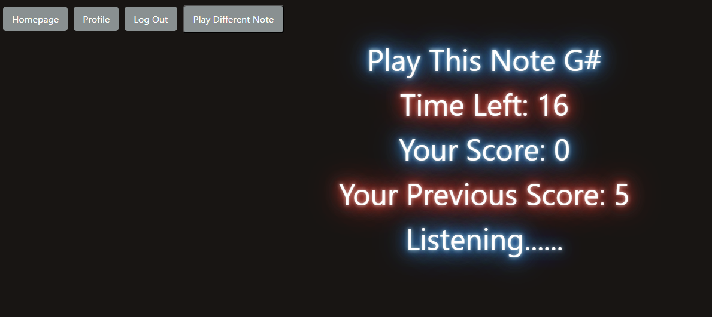
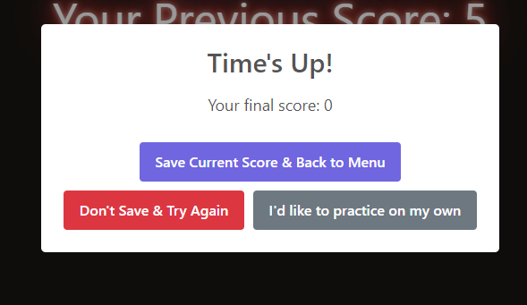

# AAYE

## Description

BlueFin is an innovative audio visualizer and music practice application designed to help users improve their musical skills. With a combination of an immersive 3D environments and an engaging music challenges, BlueFin makes practicing musical notes both fun and educational.  
Take a look at BlueFin [here](https://murmuring-thicket-14542-74d2838aa204.herokuapp.com/)

## Table of Contents

- [Installation](#installation)
- [Usage](#usage)
- [Credits](#credits)
- [License](#license)
- [Features](#features)
- [How To Contribute](#how-to-contribute)

## Installation

To run BlueFin on your local machine, follow these steps: 
Clone the BlueFin repository: 
bash 
Copy code 
git clone https://github.com/yourusername/bluefin.git 
Navigate to the project directory: 
bash 
Copy code 
cd bluefin 
Install the necessary dependencies: 
bash 
Copy code 
npm install 
Start the application: 
bash 
Copy code 
npm start 
Open your web browser and visit http://localhost:3000 to access BlueFin. 
Technologies Used 
BlueFin is built using the following technologies: 
React.js: Front-end development. 
Three.js: Creating immersive 3D environments. 
Node.js: Back-end development (not mentioned but assumed). 
MongoDB: Database for storing user profiles and scores (not mentioned but assumed). 
Authentication Library: For secure user authentication (not specified, choose one like Passport.js, Firebase, etc.). 

## Usage

Create an account or log in to access the app's features.
  

  

Explore the 3D environments and navigate to the practice room.
  

  
Choose your desired difficulty level: easy or hard.
  

  
The app will play musical notes, and the timer will start.
  
Try to hit as many notes as possible within the time limit.
  

  
Save your scores, set personal goals, and track your progress on your profile page.
  

  
Enjoy practicing and improving your musical skills with BlueFin!

## Credits

3D models  
Music studio: https://sketchfab.com/3d-models/music-studio-at-home-d4bcb0a0536f49929694768ba5a1d771  
license: CC Attribution-NonCommercial( https://creativecommons.org/licenses/by-nc/4.0/)  
artist: https://sketchfab.com/Ezgarth  
Boombox: https://sketchfab.com/3d-models/bluetooth-music-boombox-1f4d347445c8431995355b482f1f1a46  
license: CC Attribution (https://creativecommons.org/licenses/by/4.0/)  
artist: https://sketchfab.com/dani-satellite 
Condenser Mic: https://sketchfab.com/3d-models/condenser-microphone-75827daad76d40d897c1ad6a2f5c128d 
license: CC Attribution(https://creativecommons.org/licenses/by/4.0/) 
artist: https://sketchfab.com/JanVancik3D 
Cassette: https://sketchfab.com/3d-models/cassette-23097478a32046e98b3804beaabe445f  
license: CC Attribution(https://creativecommons.org/licenses/by/4.0/) 
artist: https://sketchfab.com/victorhugohc 
Tape Recorder: https://sketchfab.com/3d-models/tape-recorder-0caffd4ffaa948a18d5bbe53d5185d47 
license: CC Attribution(https://creativecommons.org/licenses/by/4.0/) 
artist: https://sketchfab.com/linus1178 
Music: https://pixabay.com/music/beats-relaxed-vlog-night-street-131746/ 
artist: https://pixabay.com/users/ashot-danielyan-composer-27049680/ 
license: https://pixabay.com/service/license-summary/ 

## License

This project is licensed under the MIT License.

## Features

User Authentication
Login and Sign-Up: 
To access BlueFin's features, users must create an account or log in securely. 
User Profile 
User Profile Page: Users have a dedicated profile page where they can view their personal information and track their progress. 
User Information: Displayed on the profile page are the user's username and email. 
Score Levels: Users can view their performance in both easy and hard modes, allowing them to monitor their progress. 
Goals and Objectives: BlueFin provides a container for users to add, edit, delete, and check off personal goals and objectives, helping them stay motivated and organized. 
3D Visualization 
Immersive Environments: BlueFin utilizes ThreeJS to create stunning 3D environments, including a portal page, a main practice room, and even a 3D login page for an engaging user experience. 
Music Practice 
Difficulty Levels: Users can choose between easy and hard modes to suit their skill level. 
Note Challenges: BlueFin plays musical notes, and a timer begins.  
Users must try to hit as many notes as possible in the allotted time. 
Score Tracking: Users can save their scores, practice more, or delete their score and try again to improve their performance. 

## How to Contribute

We welcome contributions from the community. Feel free to submit bug reports, feature requests, or even pull requests to help make BlueFin even better.

## Contact

For any questions, please contact our team via the channels below:  
* [Andy Godoy](https://github.com/AndyGodoy)
* [Jay Liu](https://github.com/Chapjae)
* [June Moon](https://github.com/moonjunsain)
* [Kayla Datte](https://github.com/kaylaasana)